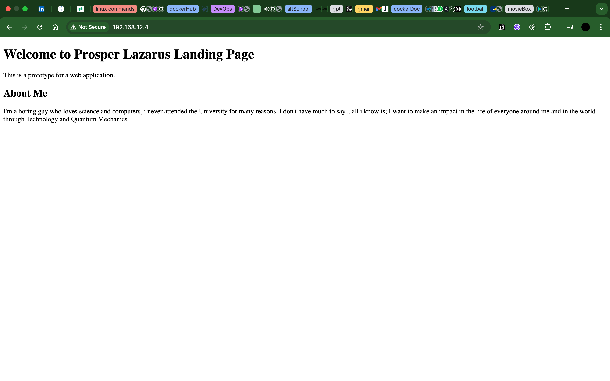

# Web Application Prototype

## IP Address
- [http://192.168.12.4)

## Steps to Provision and Deploy

1. **Provision the Server**
   - Used vagrant launch an Ubuntu instance.

2. **Install Web Server**
   - Installed nginx web server.
   - Verified the server was accessible on port 80.

3. **Deploy HTML Page**
   - Created a simple HTML file with personal and project information.
   - Copied it to the server and deployed it to `/var/www/html`.

## Screenshot

